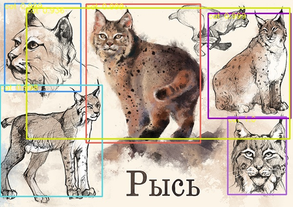

# ReadMe
### 任务

在目标检测任务上实现主动学习。

该项目的目标检测部分主要在 [这份开源代码](https://github.com/ouening/pytorch_fasterrcnn_detection) 基础上进行了修改和二次开发，同时参考了 pytorch 官方人员实现的 [cocoapi](https://github.com/philferriere/cocoapi) 以及 [官方文档](https://pytorch.org/docs/stable/_modules/torchvision.html)，在此一并表示感谢！

### 项目主要文件说明

> 所有运行时文件均迁移进 `ActiveLearning` 中，根目录下的 py 文件为原始 Faster RCNN 的相关函数文件。

#### 1 Faster RCNN

- 训练&测试：

  使用 `ActiveLearning/faster_rcnn_baseline_train.py` 进行训练和测试，详见代码注释；

  训练时需要将数据按以下格式放入 `ActiveLearning/dataset` 文件夹下：

  ```
  datasets:
  	- datasetname:
  		- faster_rcnn_baseline:
  			- train:
  				- Annotations	# 存放标注 xml 标注文件
  				- JPEGImages 	# 存放 jpg 图像文件
  			- test:
  				- Annotations
  				- JPEGImages
  ```

- 单个图片目标检测测试：

  `prediction.py` 进行单图片检测效果展示；



#### 2 Active Learning

这里自己主要提供了两种挑选策略：

- random
- least confidence

挑选策略功能函数在 `ActiveLearning/ac_strategy` 下。

##### 数据准备：

和 Faster RCNN 类似，将数据按以下格式放入 `ActiveLearning/dataset` 文件夹下：

```
datasets:
	- datasetname:
		- active_learning:
			- train:
				- Annotations	# 标注文件（XML）
				- JPEGImages	# 图像文件（JPG）
			- test:
				- Annotations
				- JPEGImages
			- unlabelpool:
				- Annotations
				- JPEGImages
```

主动学习流程如下：

1. 初始将所有数据分为 unlabelpool 和 test；
2. 从 unlabelpool 中随机挑选 10% 数据作为初始 train 集；
3. 训练初始模型；
4. 利用模型对 unlabelpool 中数据进行检测，得到检测结果，根据不同的采样策略进行采样，每次采样 5% 的数据，并将数据从 unlabelpool 移动到 train 中；
5. 重复 4，直到 unlabelpool 为空；

##### 训练：

两种策略对应的主动学习训练文件分别为：

- `ActiveLearning/ac_random_choose_auto_ac_train_and_choose.py` （随机）
- `ActiveLearning/ac_uncertain_choose_auto_ac_train_and_choose.py` （最小置信度）

其中 5% 的采样数值需要自己指定，该参数通过上面两个文件中的 `M` 参数调控；